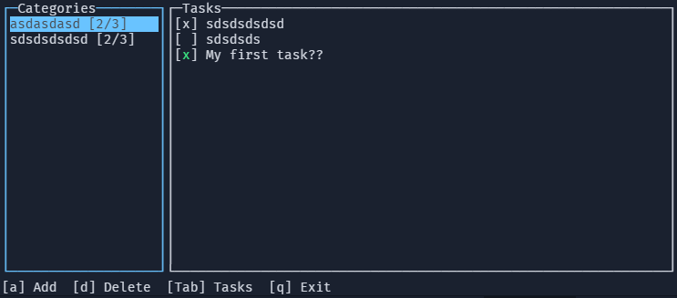

# TUIDO (WIP)

**TUIDO** _(TUI + TODO)_ is a simple **terminal-based TODO application** built with Node.js and Blessed.  
It allows you to manage **categories** and **tasks** in a full-screen TUI with keyboard navigation.



---

## Features

- Fullscreen terminal interface using **Blessed**
- Manage **categories** (e.g., Home, Work)
- Manage **tasks** inside each category
- Keyboard navigation:
  - `[a]` Add category/task
  - `[Tab]` Switch focus to categories/tasks
  - `[x]` Mark task as done
  - `[d]` Delete task/category
  - `[q]` Quit
- Dynamic header showing category and progress
- Footer shows **contextual hints** and **actions** (success or error messages)
- Actions disappear automatically after 3 seconds
- Different colors for header, footer, cursor, and error messages
- Data is stored in a JSON file (configurable via `.env`)

---

## Installation

1. Clone the repository:

```
git clone https://github.com/yourusername/tuido.git
cd tuido
```

2. Install dependencies:

```
npm install
```

3. (Optional) Configure `.env` file to set a custom data file path:

```
DB_FILE=./mytasks.json
```

---

## Usage

1. Run TUIDO:

```
node bin/tuido.js
```

Or link it to your `$PATH`:

```
npm link
tuido
```

2. Navigate with **keyboard**:

- On category screen:
  - `[a]` Add category
  - `[Enter]` Enter category
  - `[q]` Quit

- On tasks screen:
  - `[a]` Add task
  - `[x]` Mark task as done
  - `[d]` Delete task
  - `[b]` Back to categories
  - `[q]` Quit

---

## Data Storage (WIP)

- Tasks are stored in a JSON file.
- By default: `./tasks.json`
- You can change the path using a `.env` file with the `DB_FILE` variable.
